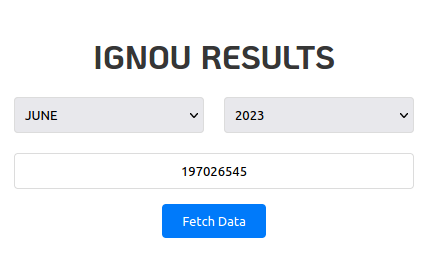

# IGNOU Term End Result Viewer

The IGNOU Term End Result Viewer is a web application built with Flask that allows users to fetch and view their term-end examination results from the result portal of Indira Gandhi National Open University.

- __View the [live](https://ignoux.vercel.app) version__.

## Features

- Fetch and display term-end examination results by providing the session and enrollment number, which removes the hassle of finding out the link related to the particular session result.

<p align="center"></p>

- Once entered, you don't have to worry about remembering your details.
- Refresh to fetch the latest results without entering any details.
- Delete locally saved data (used for offline viewing) when no longer needed.

## Run

To run the project locally, follow these steps:

1. Clone the repository and navigate to the project directory:

```bash
git clone https://github.com/CodeDotJS/ignou.git
cd ignou
```

2. Install dependencies using pip:


```bash
pip install -r requirements.txt
```

3. Run the Flask application:

```bash
python app.py
```

4. Open your web browser and go to http://localhost:5000 to access the application.

## Plan

It's an on going project where I'll build multiple tools to simplify IGNOU related tasks.

[X] CLI for IGNOU Term End Result Viewer - [`View`](ter.py)

## License

MIT &copy; Rishi Giri
